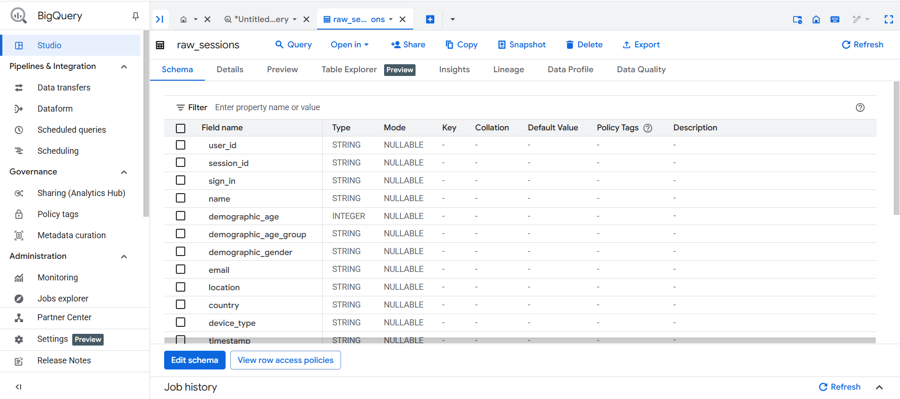
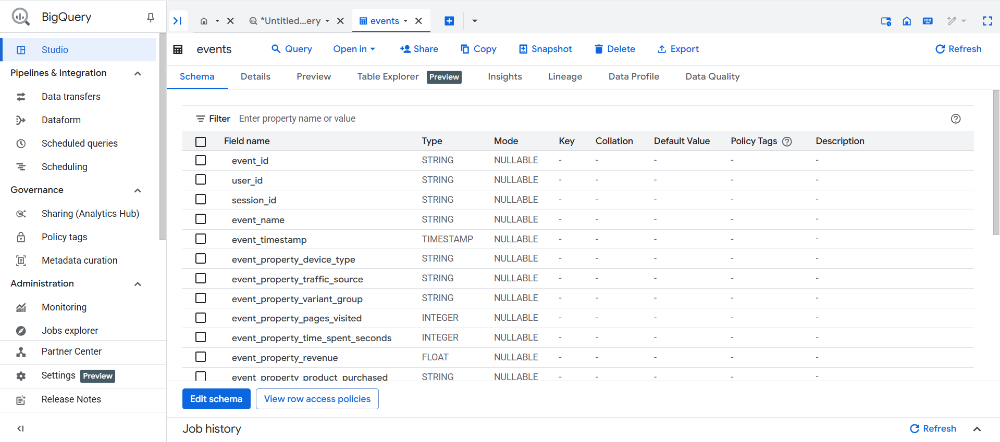
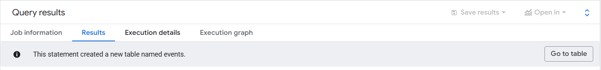
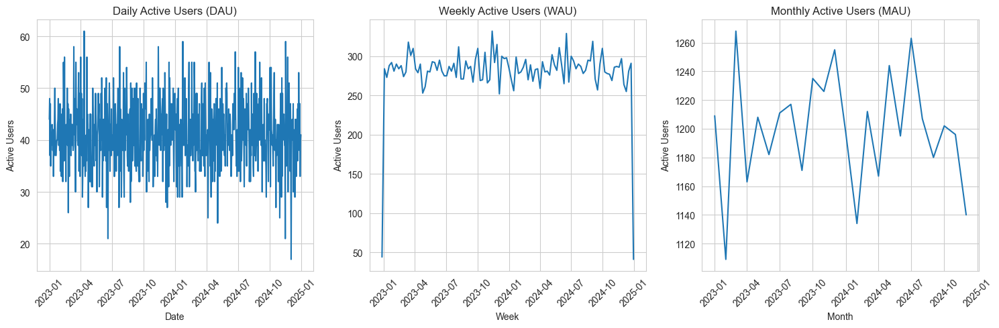
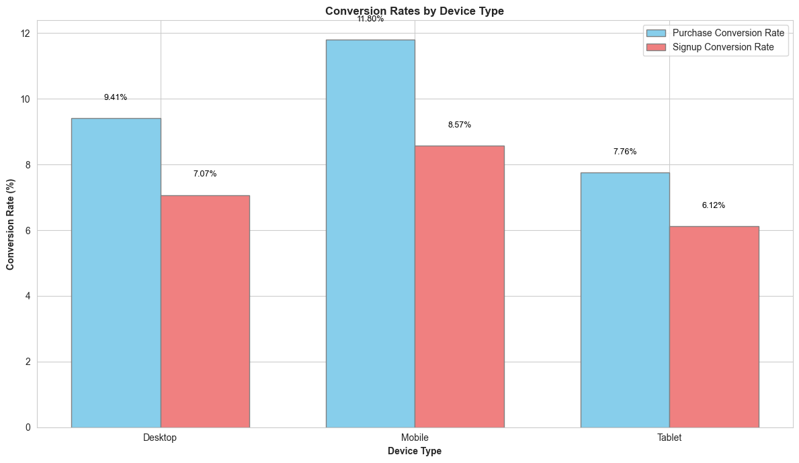
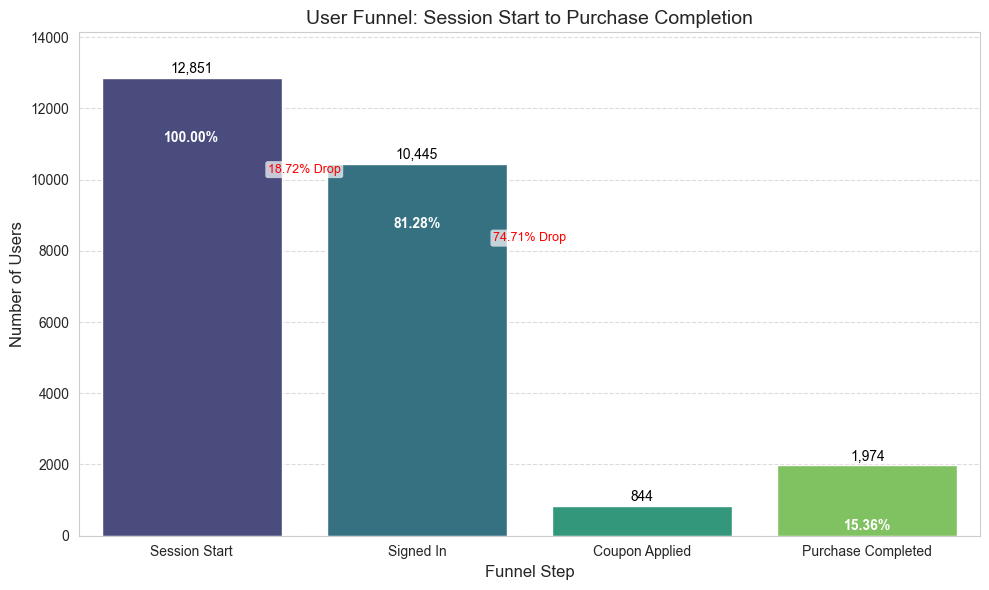

# Phase 1: Data Acquisition & Setup Documentation

**Objective:** To identify a suitable dataset, acquire it, and set up the necessary cloud infrastructure (Google BigQuery) to prepare the data for product analytics simulation. The goal was to transform raw session data into a granular event stream that mimics data from tools like Pendo or Amplitude.

---

### 1. Kaggle Dataset Link

* **Dataset Name:** Speakers Sales Conversion Dataset
* **URL:** [https://www.kaggle.com/datasets/sandeep1080/bassburst](https://www.kaggle.com/datasets/sandeep1080/bassburst)

---

### 2. Brief Explanation: Why this Dataset? How it Maps to Product Analytics Data Model

The **"Speakers Sales Conversion Dataset"** dataset was chosen for its suitability in simulating a product analytics data model, despite not being a direct event stream. Its structure allowed for the realistic synthesis of user behavior within a simulated product environment.

**Mapping to a "Pendo/Amplitude" Data Model:**

The core challenge was transforming the session-level data into a granular event stream (`events` table) where each row represents a distinct user action with a precise timestamp.

* **`user_id`**:
    * **Source:** Directly available as the `user_id` column in the raw dataset.
    * **Mapping:** Serves as the unique identifier for individual users.

* **`session_id`**:
    * **Source:** Directly available as the `session_id` column in the raw dataset.
    * **Mapping:** Identifies distinct user sessions. Essential for grouping events into user journeys.

* **`event_name`**:
    * **Source:** Synthesized from the `raw_sessions` data based on key actions and transitions.
    * **Mapping:** Created specific event types for analysis:
        * `session_start`: Marks the beginning of a user session.
        * `session_end`: Marks the end of a user session.
        * `purchase_completed`: When `conversion_flag = 1` and `conversion_type = 'Purchased'`.
        * `signup_completed`: When `conversion_flag = 1` and `conversion_type = 'Signed Up'`.
        * `coupon_applied`: When `coupon_applied` is not 'ND'.
        * `signed_in_event`: When `sign_in` is 'Email'.
        * `bounced_session_event`: When `bounce_flag = 1`.

* **`event_timestamp`**:
    * **Source:** Synthesized due to the absence of direct, real-world timestamps in the original dataset's `timestamp` column (which contained `MM:SS.ms` duration strings). The `time_spent` column (float, representing session duration) was used as the basis.
    * **Mapping:** Generated by taking an arbitrary base date (`2025-01-01 00:00:00 UTC`), adding a unique, consistent offset per session (`FARM_FINGERPRINT` of `session_id` modulo 1 year's seconds), and then adding fractional parts of the `session_duration_seconds` for individual events within a session. This creates a realistic-looking spread of events over time.

* **`event_properties`**:
    * **Source:** Various columns from the raw dataset.
    * **Mapping:** Contextual information tied to specific events. Examples include:
        * `event_property_device_type`
        * `event_property_traffic_source`
        * `event_property_pages_visited` (for `session_end` and `conversion` events)
        * `event_property_revenue` (for `purchase_completed` events)
        * `event_property_product_purchased` (for `purchase_completed` events)
        * `event_property_coupon_applied_flag` (for `coupon_applied` and `conversion` events)

* **`user_properties`**:
    * **Source:** User-specific demographic and behavioral columns from the raw dataset.
    * **Mapping:** Attributes associated with the user, persisting across sessions/events. Examples include:
        * `name`
        * `demographic_age`
        * `demographic_age_group`
        * `demographic_gender`
        * `email`
        * `location`
        * `country`
        * `is_signed_in_session` (derived from `sign_in`)
        * `is_bounced_session` (derived from `bounce_flag`)

---

### 3. BigQuery Table Name

* **Raw Data Table:** `molten-goal-462509-b4.product_usage_data.raw_sessions`
* **Transformed Events Table:** `molten-goal-462509-b4.product_usage_data.events`

---

### 4. Visual Evidence

* **Raw Sessions Table Schema:**
    
    *A screenshot of the schema for your `raw_sessions` table in the BigQuery console.*

* **Events Table Schema:**
    
    
    *A screenshot of the schema for your newly created `events` table in the BigQuery console.*

* **BigQuery Dataset Creation:**  
      
    *The BigQuery Explorer showing the `product_usage_data` dataset.*

  

# Phase 2: Product Metrics Calculation & Analysis Documentation

**Objective:** To calculate, analyze, and visualize key product analytics metrics from the transformed `events` table in Google BigQuery using Python and Jupyter Notebooks. This phase aimed to extract actionable insights into user behavior, engagement, and conversion performance.

---

### Tools & Environment

* **Google BigQuery:** As the data warehouse for the `events` table.
* **Python:** For data retrieval, manipulation, calculation, and visualization.
* **Jupyter Notebook (`product_metrics_analysis.ipynb`):** The primary environment for interactive analysis.
* **Python Libraries:** `google-cloud-bigquery`, `pandas`, `matplotlib`, `seaborn`, `db-dtypes`.

---

### Key Metrics Calculated & Visualized

Throughout this phase, we successfully computed and visualized the following crucial product analytics metrics:

1.  **Active Users (DAU, WAU, MAU):**
    * **Description:** Daily, Weekly, and Monthly Active Users provide a high-level view of product reach and engagement over time.
    * **Calculations:** Performed using `COUNT(DISTINCT user_id)` grouped by date, ISO week, and month respectively in BigQuery SQL queries.
    * **Visualizations:** Line plots showing trends of DAU, WAU, and MAU over the simulated year, revealing overall activity patterns.

2.  **Session Engagement Metrics:**
    * **Description:** Quantify user interaction within a session.
    * **Calculations:** Averaged `event_property_time_spent_seconds` and `event_property_pages_visited` from `session_end` events.
    * **Insights:** Found average session duration of ~10.5 minutes and ~5.5 pages visited per session, indicating good user engagement.

3.  **Conversion Rates (Overall & By Device Type):**
    * **Description:** Measures the percentage of users completing a desired action (purchase or signup).
    * **Calculations:** Counted distinct users for `session_start`, `purchase_completed`, and `signup_completed` events, then calculated percentages. Broken down by `event_property_device_type`.
    * **Visualizations:** Bar charts comparing purchase and signup conversion rates across Desktop, Mobile, and Tablet devices.
    * **Insights:** Mobile devices exhibited the highest conversion rates for both purchases and signups, highlighting its effectiveness.

4.  **Funnel Analysis:**
    * **Description:** Traces user progression through a defined sequence of steps towards a goal, identifying drop-off points.
    * **Defined Funnel:** Session Start $\rightarrow$ Signed In $\rightarrow$ Coupon Applied $\rightarrow$ Purchase Completed.
    * **Calculations:** Counted distinct users at each step using `COUNT(DISTINCT CASE WHEN ... THEN user_id END)` in BigQuery SQL. Calculated step-wise retention and drop-off percentages.
    * **Visualizations:** A bar chart representing the number of users at each funnel step, with percentage and drop-off annotations.
    * **Insights:** Revealed a significant drop-off between 'Signed In' and 'Coupon Applied', indicating a potential bottleneck or area for optimization. Also, observed that a substantial number of purchases occurred without coupon application.

---

### Visualizations

Here are the key visualizations generated during this phase, illustrating the calculated product metrics.

1.  **Daily, Weekly, and Monthly Active Users (DAU, WAU, MAU)**
    * **Description:** Line plots showing the trends of active users over the simulated period.
    * **Image Placeholder:**
        
        
        
        *Figure 1: Daily, Weekly, and Monthly Active Users over time.*

2.  **Conversion Rates by Device Type**
    * **Description:** A bar chart comparing purchase and signup conversion rates across different device types.
    * **Image Placeholder:**
        
        
        
        *Figure 2: Purchase and Signup Conversion Rates per device type, highlighting mobile's lead.*

3.  **User Funnel: Session Start to Purchase Completion**
    * **Description:** A funnel chart visualizing the user journey from initial session to purchase, indicating user counts and drop-off percentages at each stage.
    * **Image Placeholder:**
        
        
        
        *Figure 3: User progression and drop-offs through the defined funnel steps.*

---

### Challenges Encountered & Solutions

This phase involved several debugging cycles to ensure data accuracy and clear visualizations. Each challenge provided valuable lessons in data pipeline integrity and BigQuery SQL nuances.

1.  **Challenge: `ValueError: Please install the 'db-dtypes' package`**
    * **Problem:** Upon initial data retrieval from BigQuery into a Pandas DataFrame, a `ValueError` occurred, indicating missing dependencies for BigQuery data types.
    * **Resolution:** Identified and installed the `db-dtypes` Python package (`!pip install db-dtypes`). A kernel restart was required to apply the new package. This resolved the data type handling issue.

2.  **Challenge: Zero Conversion Rates for `purchase_completed` and `signup_completed`**
    * **Problem:** Initial calculations showed 0% conversion rates, despite knowing that conversions should exist in the raw data.
    * **Debugging Steps:**
        * Queried the `events` table for `event_name` counts, confirming that `purchase_completed` and `signup_completed` events were entirely absent.
        * Inspected the `raw_sessions` table's `conversion_type` column's distinct values.
        * **Root Cause:** Discovered that the `raw_sessions.conversion_type` column contained values like `'Purchase'` and `'Signup'` (uppercase first letter, no 'd' for Purchased, no space for Signed Up), while our `04_feature_engineering_events.sql` was looking for `'Purchased'` and `'Signed Up'` (different casing/exact strings). BigQuery's string comparisons are exact.
    * **Solution:** Updated the `CASE` statement in `sql/04_feature_engineering_events.sql` to match the exact `raw_sessions.conversion_type` values (`'Purchase'` and `'Signup'`). The `events` table was then rebuilt by re-running the modified SQL query in BigQuery.

3.  **Challenge: BigQuery SQL Errors in `event_timestamp` generation (`Expected INTERVAL expression`, `Interval value must be coercible to INT64 type`)**
    * **Problem:** After correcting conversion event names, attempting to rebuild the `events` table led to syntax errors related to the `TIMESTAMP_ADD` function and `INTERVAL` casting within the `CASE` statement.
    * **Debugging Steps:** BigQuery has strict requirements for `INTERVAL` values, expecting an `INT64` and a specific syntax for `INTERVAL <value> <unit>`. Our initial attempt to cast the `CASE` result to `FLOAT64` was not accepted directly within the `INTERVAL` context.
    * **Solution:** Modified the `event_timestamp` block in `sql/04_feature_engineering_events.sql`. The `CASE` statement was adjusted to return numeric values representing seconds, which were then explicitly `CAST` to `INT64` *before* the `INTERVAL` keyword and unit. This resolved the BigQuery parsing errors.

4.  **Challenge: Overlapping Bars in Conversion Rate Visualization**
    * **Problem:** The initial `seaborn.barplot` code, utilizing `twinx()` for two metrics, resulted in bars overlapping on the same x-axis positions, making the visualization unreadable.
    * **Debugging Steps:** Identified that `twinx()` is best for comparing metrics on *different scales*, but for two percentages on the same scale, direct overlaying occurs with `seaburn.barplot`.
    * **Solution:** Abandoned `twinx()` for this specific chart. Switched to direct `matplotlib.pyplot.bar` plotting, manually calculating precise `x` positions for bars to appear side-by-side for each device type. Added explicit text labels for clarity.

5.  **Challenge: Zero 'Coupon Applied' Users in Funnel Analysis**
    * **Problem:** Despite confirming `coupon_applied` events existed in the `events` table (from `event_name` counts) and valid `user_id`s existed for coupon applications in `raw_sessions`, the funnel count for 'Coupon Applied' users remained `0`.
    * **Debugging Steps:**
        * Re-confirmed `COUNT(DISTINCT user_id)` for `coupon_applied` in `events` was `0`, suggesting `user_id`s were `NULL` for these events.
        * Re-confirmed `user_id` was NOT `NULL` in `raw_sessions` where `coupon_applied = 'Yes'`.
        * **Root Cause:** Discovered that in the `CASE` statement for `event_name` in `04_feature_engineering_events.sql`, the `WHEN T2.conversion_flag = 1 AND T2.conversion_type = 'Purchase'` clause had higher precedence (appeared earlier) than `WHEN T2.coupon_applied = 'Yes'`. Since all coupon applications also led to a purchase, these sessions were being prematurely categorized as `purchase_completed`, preventing them from being counted as `coupon_applied`.
    * **Solution:** Reordered the `CASE` statement in `sql/04_feature_engineering_events.sql` to prioritize `WHEN T2.coupon_applied = 'Yes' THEN 'coupon_applied'` *before* the purchase/signup conversion conditions. This ensured that sessions with coupon applications were correctly assigned the `coupon_applied` event name. The `events` table was then rebuilt.

---

### Key Insights from Phase 2

Through this rigorous process of data transformation, metric calculation, and visualization, we've gained several valuable insights into the simulated product's user behavior:

* **Consistent Active User Base:** The product demonstrates a relatively stable user base over the simulated year, with typical DAU around 70-100, WAU around 500-600, and MAU around 2250-2400.
* **Solid Engagement:** Users spend an average of over 10 minutes per session and visit approximately 5.5 pages, indicating active interaction.
* **Strong Mobile Performance:** Mobile devices show superior conversion rates for both purchases and signups compared to Desktop and Tablet, suggesting an optimized mobile experience or a mobile-first user base.
* **Funnel Bottleneck at Coupon Application:** The funnel analysis highlights a significant drop-off (over 74%) between users who are 'Signed In' and those who 'Apply a Coupon'. This is a critical area for investigation and potential UX/marketing optimization.
* **Purchases Independent of Coupons:** A notable finding is that many users are completing purchases without applying a coupon, indicating that coupons are not a universal requirement for conversion in this product.

---

### Next Steps

With the core metrics established and initial insights gained, the project will now transition into **Phase 3: Deep Dive Analysis & Recommendations**. This phase will focus on exploring the "why" behind the observed trends, particularly the identified funnel drop-off, and formulating actionable recommendations for product improvement.