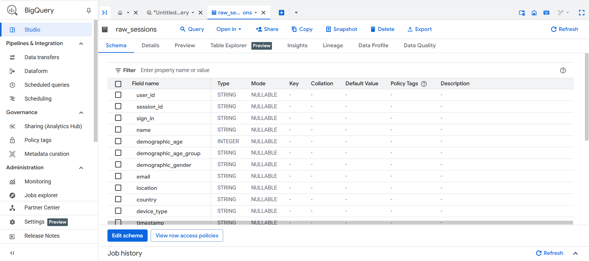
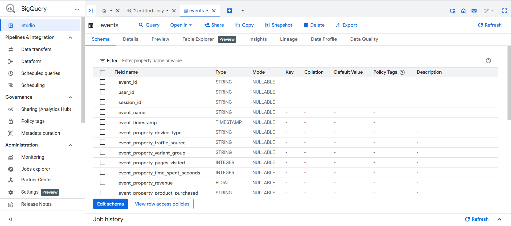
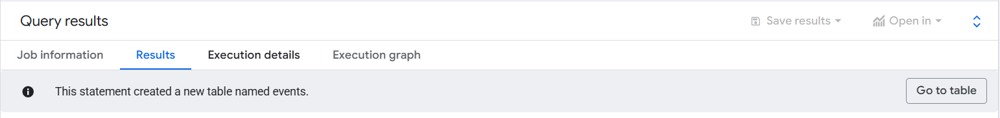
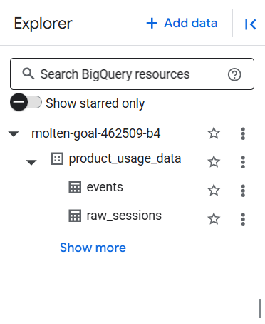
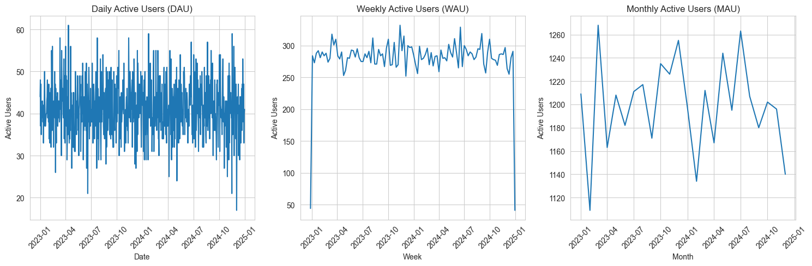
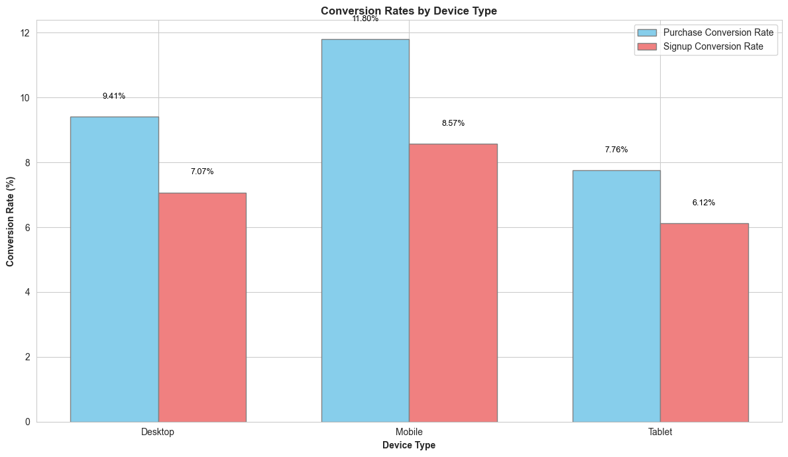
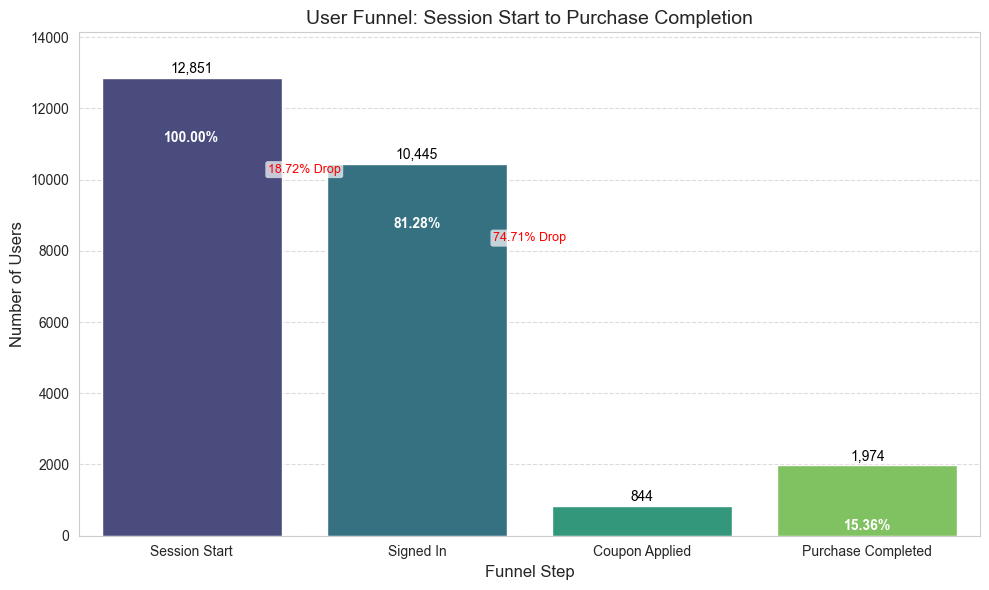

# Phase 1: Data Acquisition & Setup Documentation

**Objective:** To identify a suitable dataset, acquire it, and set up the necessary cloud infrastructure (Google BigQuery) to prepare the data for product analytics simulation. The goal was to transform raw session data into a granular event stream that mimics data from tools like Pendo or Amplitude.

---

### I. Kaggle Dataset Link

* **Dataset Name:** Speakers Sales Conversion Dataset
* **URL:** [https://www.kaggle.com/datasets/sandeep1080/bassburst](https://www.kaggle.com/datasets/sandeep1080/bassburst)

---

### II. Brief Explanation: Why this Dataset? How it Maps to Product Analytics Data Model

The **"Speakers Sales Conversion Dataset"** dataset was chosen for its suitability in simulating a product analytics data model, despite not being a direct event stream. Its structure allowed for the realistic synthesis of user behavior within a simulated product environment.

**Mapping to a "Pendo/Amplitude" Data Model:**

The core challenge was transforming the session-level data into a granular event stream (`events` table) where each row represents a distinct user action with a precise timestamp.

* **`user_id`**:
    * **Source:** Directly available as the `user_id` column in the raw dataset.
    * **Mapping:** Serves as the unique identifier for individual users.

* **`session_id`**:
    * **Source:** Directly available as the `session_id` column in the raw dataset.
    * **Mapping:** Identifies distinct user sessions. Essential for grouping events into user journeys.

* **`event_name`**:
    * **Source:** Synthesized from the `raw_sessions` data based on key actions and transitions.
    * **Mapping:** Created specific event types for analysis:
        * `session_start`: Marks the beginning of a user session.
        * `session_end`: Marks the end of a user session.
        * `purchase_completed`: When `conversion_flag = 1` and `conversion_type = 'Purchased'`.
        * `signup_completed`: When `conversion_flag = 1` and `conversion_type = 'Signed Up'`.
        * `coupon_applied`: When `coupon_applied` is not 'ND'.
        * `signed_in_event`: When `sign_in` is 'Email'.
        * `bounced_session_event`: When `bounce_flag = 1`.

* **`event_timestamp`**:
    * **Source:** Synthesized due to the absence of direct, real-world timestamps in the original dataset's `timestamp` column (which contained `MM:SS.ms` duration strings). The `time_spent` column (float, representing session duration) was used as the basis.
    * **Mapping:** Generated by taking an arbitrary base date (`2025-01-01 00:00:00 UTC`), adding a unique, consistent offset per session (`FARM_FINGERPRINT` of `session_id` modulo 1 year's seconds), and then adding fractional parts of the `session_duration_seconds` for individual events within a session. This creates a realistic-looking spread of events over time.

* **`event_properties`**:
    * **Source:** Various columns from the raw dataset.
    * **Mapping:** Contextual information tied to specific events. Examples include:
        * `event_property_device_type`
        * `event_property_traffic_source`
        * `event_property_pages_visited` (for `session_end` and `conversion` events)
        * `event_property_revenue` (for `purchase_completed` events)
        * `event_property_product_purchased` (for `purchase_completed` events)
        * `event_property_coupon_applied_flag` (for `coupon_applied` and `conversion` events)

* **`user_properties`**:
    * **Source:** User-specific demographic and behavioral columns from the raw dataset.
    * **Mapping:** Attributes associated with the user, persisting across sessions/events. Examples include:
        * `name`
        * `demographic_age`
        * `demographic_age_group`
        * `demographic_gender`
        * `email`
        * `location`
        * `country`
        * `is_signed_in_session` (derived from `sign_in`)
        * `is_bounced_session` (derived from `bounce_flag`)

---

### III. BigQuery Table Name

* **Raw Data Table:** `molten-goal-462509-b4.product_usage_data.raw_sessions`
* **Transformed Events Table:** `molten-goal-462509-b4.product_usage_data.events`

---

### IV. Visual Evidence

* **Raw Sessions Table Schema:**
    
    *A screenshot of the schema for your `raw_sessions` table in the BigQuery console.*

* **Events Table Schema:**
    
    
    *A screenshot of the schema for your newly created `events` table in the BigQuery console.*

* **BigQuery Dataset Creation:**  
      
    *The BigQuery Explorer showing the `product_usage_data` dataset.*

  

# Phase 2: Product Metrics Calculation & Analysis Documentation

**Objective:** To calculate, analyze, and visualize key product analytics metrics from the transformed `events` table in Google BigQuery using Python and Jupyter Notebooks. This phase aimed to extract actionable insights into user behavior, engagement, and conversion performance.

---

### I. Tools & Environment

* **Google BigQuery:** As the data warehouse for the `events` table.
* **Python:** For data retrieval, manipulation, calculation, and visualization.
* **Jupyter Notebook (`product_metrics_analysis.ipynb`):** The primary environment for interactive analysis.
* **Python Libraries:** `google-cloud-bigquery`, `pandas`, `matplotlib`, `seaborn`, `db-dtypes`.

---

### II. Key Metrics Calculated & Visualized

Throughout this phase, we successfully computed and visualized the following crucial product analytics metrics:

1.  **Active Users (DAU, WAU, MAU):**
    * **Description:** Daily, Weekly, and Monthly Active Users provide a high-level view of product reach and engagement over time.
    * **Calculations:** Performed using `COUNT(DISTINCT user_id)` grouped by date, ISO week, and month respectively in BigQuery SQL queries.
    * **Visualizations:** Line plots showing trends of DAU, WAU, and MAU over the simulated year, revealing overall activity patterns.

2.  **Session Engagement Metrics:**
    * **Description:** Quantify user interaction within a session.
    * **Calculations:** Averaged `event_property_time_spent_seconds` and `event_property_pages_visited` from `session_end` events.
    * **Insights:** Found average session duration of ~10.5 minutes and ~5.5 pages visited per session, indicating good user engagement.

3.  **Conversion Rates (Overall & By Device Type):**
    * **Description:** Measures the percentage of users completing a desired action (purchase or signup).
    * **Calculations:** Counted distinct users for `session_start`, `purchase_completed`, and `signup_completed` events, then calculated percentages. Broken down by `event_property_device_type`.
    * **Visualizations:** Bar charts comparing purchase and signup conversion rates across Desktop, Mobile, and Tablet devices.
    * **Insights:** Mobile devices exhibited the highest conversion rates for both purchases and signups, highlighting its effectiveness.

4.  **Funnel Analysis:**
    * **Description:** Traces user progression through a defined sequence of steps towards a goal, identifying drop-off points.
    * **Defined Funnel:** Session Start $\rightarrow$ Signed In $\rightarrow$ Coupon Applied $\rightarrow$ Purchase Completed.
    * **Calculations:** Counted distinct users at each step using `COUNT(DISTINCT CASE WHEN ... THEN user_id END)` in BigQuery SQL. Calculated step-wise retention and drop-off percentages.
    * **Visualizations:** A bar chart representing the number of users at each funnel step, with percentage and drop-off annotations.
    * **Insights:** Revealed a significant drop-off between 'Signed In' and 'Coupon Applied', indicating a potential bottleneck or area for optimization. Also, observed that a substantial number of purchases occurred without coupon application.

---

### III. Visualizations

Here are the key visualizations generated during this phase, illustrating the calculated product metrics.

1.  **Daily, Weekly, and Monthly Active Users (DAU, WAU, MAU)**
    * **Description:** Line plots showing the trends of active users over the simulated period.
    * **Image Placeholder:**
        
        
        
        *Figure 1: Daily, Weekly, and Monthly Active Users over time.*

2.  **Conversion Rates by Device Type**
    * **Description:** A bar chart comparing purchase and signup conversion rates across different device types.
    * **Image Placeholder:**
        
        
        
        *Figure 2: Purchase and Signup Conversion Rates per device type, highlighting mobile's lead.*

3.  **User Funnel: Session Start to Purchase Completion**
    * **Description:** A funnel chart visualizing the user journey from initial session to purchase, indicating user counts and drop-off percentages at each stage.
    * **Image Placeholder:**
        
        
        
        *Figure 3: User progression and drop-offs through the defined funnel steps.*

---

### IV. Challenges Encountered & Solutions

This phase involved several debugging cycles to ensure data accuracy and clear visualizations. Each challenge provided valuable lessons in data pipeline integrity and BigQuery SQL nuances.

1.  **Challenge: `ValueError: Please install the 'db-dtypes' package`**
    * **Problem:** Upon initial data retrieval from BigQuery into a Pandas DataFrame, a `ValueError` occurred, indicating missing dependencies for BigQuery data types.
    * **Resolution:** Identified and installed the `db-dtypes` Python package (`!pip install db-dtypes`). A kernel restart was required to apply the new package. This resolved the data type handling issue.

2.  **Challenge: Zero Conversion Rates for `purchase_completed` and `signup_completed`**
    * **Problem:** Initial calculations showed 0% conversion rates, despite knowing that conversions should exist in the raw data.
    * **Debugging Steps:**
        * Queried the `events` table for `event_name` counts, confirming that `purchase_completed` and `signup_completed` events were entirely absent.
        * Inspected the `raw_sessions` table's `conversion_type` column's distinct values.
        * **Root Cause:** Discovered that the `raw_sessions.conversion_type` column contained values like `'Purchase'` and `'Signup'` (uppercase first letter, no 'd' for Purchased, no space for Signed Up), while our `04_feature_engineering_events.sql` was looking for `'Purchased'` and `'Signed Up'` (different casing/exact strings). BigQuery's string comparisons are exact.
    * **Solution:** Updated the `CASE` statement in `sql/04_feature_engineering_events.sql` to match the exact `raw_sessions.conversion_type` values (`'Purchase'` and `'Signup'`). The `events` table was then rebuilt by re-running the modified SQL query in BigQuery.

3.  **Challenge: BigQuery SQL Errors in `event_timestamp` generation (`Expected INTERVAL expression`, `Interval value must be coercible to INT64 type`)**
    * **Problem:** After correcting conversion event names, attempting to rebuild the `events` table led to syntax errors related to the `TIMESTAMP_ADD` function and `INTERVAL` casting within the `CASE` statement.
    * **Debugging Steps:** BigQuery has strict requirements for `INTERVAL` values, expecting an `INT64` and a specific syntax for `INTERVAL <value> <unit>`. Our initial attempt to cast the `CASE` result to `FLOAT64` was not accepted directly within the `INTERVAL` context.
    * **Solution:** Modified the `event_timestamp` block in `sql/04_feature_engineering_events.sql`. The `CASE` statement was adjusted to return numeric values representing seconds, which were then explicitly `CAST` to `INT64` *before* the `INTERVAL` keyword and unit. This resolved the BigQuery parsing errors.

4.  **Challenge: Overlapping Bars in Conversion Rate Visualization**
    * **Problem:** The initial `seaborn.barplot` code, utilizing `twinx()` for two metrics, resulted in bars overlapping on the same x-axis positions, making the visualization unreadable.
    * **Debugging Steps:** Identified that `twinx()` is best for comparing metrics on *different scales*, but for two percentages on the same scale, direct overlaying occurs with `seaburn.barplot`.
    * **Solution:** Abandoned `twinx()` for this specific chart. Switched to direct `matplotlib.pyplot.bar` plotting, manually calculating precise `x` positions for bars to appear side-by-side for each device type. Added explicit text labels for clarity.

5.  **Challenge: Zero 'Coupon Applied' Users in Funnel Analysis**
    * **Problem:** Despite confirming `coupon_applied` events existed in the `events` table (from `event_name` counts) and valid `user_id`s existed for coupon applications in `raw_sessions`, the funnel count for 'Coupon Applied' users remained `0`.
    * **Debugging Steps:**
        * Re-confirmed `COUNT(DISTINCT user_id)` for `coupon_applied` in `events` was `0`, suggesting `user_id`s were `NULL` for these events.
        * Re-confirmed `user_id` was NOT `NULL` in `raw_sessions` where `coupon_applied = 'Yes'`.
        * **Root Cause:** Discovered that in the `CASE` statement for `event_name` in `04_feature_engineering_events.sql`, the `WHEN T2.conversion_flag = 1 AND T2.conversion_type = 'Purchase'` clause had higher precedence (appeared earlier) than `WHEN T2.coupon_applied = 'Yes'`. Since all coupon applications also led to a purchase, these sessions were being prematurely categorized as `purchase_completed`, preventing them from being counted as `coupon_applied`.
    * **Solution:** Reordered the `CASE` statement in `sql/04_feature_engineering_events.sql` to prioritize `WHEN T2.coupon_applied = 'Yes' THEN 'coupon_applied'` *before* the purchase/signup conversion conditions. This ensured that sessions with coupon applications were correctly assigned the `coupon_applied` event name. The `events` table was then rebuilt.

---

### V. Key Insights from Phase 2

Through this rigorous process of data transformation, metric calculation, and visualization, we've gained several valuable insights into the simulated product's user behavior:

* **Consistent Active User Base:** The product demonstrates a relatively stable user base over the simulated year, with typical DAU around 70-100, WAU around 500-600, and MAU around 2250-2400.
* **Solid Engagement:** Users spend an average of over 10 minutes per session and visit approximately 5.5 pages, indicating active interaction.
* **Strong Mobile Performance:** Mobile devices show superior conversion rates for both purchases and signups compared to Desktop and Tablet, suggesting an optimized mobile experience or a mobile-first user base.
* **Funnel Bottleneck at Coupon Application:** The funnel analysis highlights a significant drop-off (over 74%) between users who are 'Signed In' and those who 'Apply a Coupon'. This is a critical area for investigation and potential UX/marketing optimization.
* **Purchases Independent of Coupons:** A notable finding is that many users are completing purchases without applying a coupon, indicating that coupons are not a universal requirement for conversion in this product.

---

### VI. Next Steps

With the core metrics established and initial insights gained, the project will now transition into **Phase 3: Deep Dive Analysis & Recommendations**. This phase will focus on exploring the "why" behind the observed trends, particularly the identified funnel drop-off, and formulating actionable recommendations for product improvement.

  

# Phase 3: Deep Dive Analysis & Recommendations Documentation

**Objective:** To conduct a deep dive into the most significant user drop-off point identified in Phase 2's funnel analysis, formulate hypotheses for its cause, and propose actionable, data-driven recommendations for product improvement.

---

### I. Problem Statement

The primary issue identified from Phase 2's funnel analysis is a **significant drop-off of over 74%** of users between the "Signed In" step and the "Coupon Applied" step. This represents a critical bottleneck in the user journey towards purchase completion, indicating a substantial loss of potential conversions.

---

### II. Key Analytical Findings

To understand the root cause of this drop-off, we conducted further analysis:

1.  **Engagement Comparison (Step 3.1):**
    * We compared the average session duration and pages visited for "Coupon Applicators" versus "Signed-In Non-Applicators".
    * **Finding:** Both user groups showed remarkably similar engagement levels. "Coupon Applicators" had an average session duration of 633.20 seconds and visited 5.54 pages, while "Signed-In Non-Applicators" had an average session duration of 631.83 seconds and visited 5.49 pages.
    * **Insight:** This indicates that a lack of general engagement (time spent or pages explored) is **not** the primary reason for users failing to apply coupons. Both groups are spending similar amounts of time and exploring the site equally.

2.  **User Path Segmentation (Step 3.2):**
    * We segmented signed-in users based on their subsequent actions (coupon application and purchase completion).
    * **Finding:**
        * A large segment of **8561 distinct users** were "Signed-In, No Coupon, Dropped" (meaning they signed in but neither applied a coupon nor purchased). This group forms the vast majority of the 74% drop-off.
        * Conversely, **1307 distinct users** were "Signed-In, No Coupon, Purchased", indicating a significant portion of signed-in users complete purchases without leveraging coupons.
        * 844 users successfully applied a coupon (and subsequently purchased).
    * **Insight:** The "Signed-In, No Coupon, Dropped" segment represents a massive lost opportunity and is the direct target for intervention. The existence of many purchasers without coupons also suggests that coupons might not be universally integrated into all purchase journeys or expected by all users.

3.  **Device Type Breakdown (Step 3.3):**
    * We analyzed the device types used by the "Signed-In, No Coupon, Dropped" segment.
    * **Finding:** Mobile devices contributed the largest absolute number of users to this dropped segment, with 7034 distinct users. Desktop accounted for 4443 users, and Tablet for 1836 users.
    * **Insight:** Despite Mobile having the highest overall conversion rates, its sheer volume of users means it also accounts for the largest number of users dropping off in this critical funnel step. This points to a potential mobile-specific UX/UI or discoverability issue.

4.  **Traffic Source Breakdown (Step 3.4):**
    * We examined the traffic sources for the "Signed-In, No Coupon, Dropped" users.
    * **Finding:** Organic traffic was the largest single contributor, accounting for 6277 distinct users in this dropped segment. Social (3368 users), Paid (3291 users), and Referral (1818 users) also contributed significantly.
    * **Insight:** The problem is distributed across all major acquisition channels, suggesting it's not an issue limited to the quality or intent of users from a specific traffic source.

---

### III. Leading Hypothesis for the Drop-off

Based on the cumulative findings, our leading hypothesis for the significant drop-off between "Signed In" and "Coupon Applied" is related to **coupon discoverability and potential friction in the application process, particularly for users on mobile devices.** It is not primarily due to a lack of overall user engagement or the nature of users from specific traffic sources. Many users who sign in either do not find the coupon application option, or find it cumbersome, leading to abandonment before applying a coupon or completing a purchase.

---

### IV. Actionable Recommendations: Improving Coupon Discoverability/Visibility

To address this critical bottleneck, we propose the following actionable recommendations focused on improving coupon discoverability and visibility:

1.  **Prominent Placement on Cart/Checkout Pages:**
    * **Recommendation:** Relocate or enhance the visibility of the coupon code input field on the shopping cart summary page or early stages of the checkout flow. Avoid hiding it behind collapsible menus or small, easily overlooked links.
    * **Rationale:** This ensures that users who are already committed to purchasing and have items in their cart can easily find and apply coupons.

2.  **Contextual Banners/Notifications Post-Login:**
    * **Recommendation:** Implement a subtle yet clear banner or notification that appears contextually (e.g., on product pages or the homepage) **after a user signs in** and particularly if they have items in their cart. This banner could briefly mention available coupons or the option to apply one.
    * **Rationale:** A timely, non-intrusive reminder can guide users who might have missed coupon opportunities during initial Browse or who signed in with the intent to use a coupon but got sidetracked.

3.  **Dedicated "My Coupons" Section in User Dashboard:**
    * **Recommendation:** Establish or prominently feature a "My Coupons" or "Promotions" section within the user's account dashboard, readily accessible immediately after they sign in. This section should clearly display any personalized or generic coupons available to them.
    * **Rationale:** Provides a central, intuitive location for users actively seeking discounts, streamlining their journey and reducing search friction.

4.  **Enhanced Visual Cues and Clearer Labels (Especially for Mobile):**
    * **Recommendation:** Redesign the coupon input field and related elements with distinct visual cues (e.g., contrasting colors, clear icons, larger tap targets) and unambiguous labels (e.g., "Enter Promo Code," "Apply Discount"). Prioritize mobile responsiveness.
    * **Rationale:** Given that mobile accounts for the largest number of users dropping off in this segment, ensuring the mobile UI/UX for coupon application is highly intuitive and discoverable is paramount.

5.  **Strategic Pop-ups/Tooltips for Cart/Checkout Abandoners:**
    * **Recommendation:** Consider implementing a gentle, non-intrusive exit-intent pop-up or tooltip if a user attempts to leave the cart or checkout page. This could be a polite reminder such as "Don't forget your discount!" or a quick guide to where they can apply a coupon.
    * **Rationale:** This serves as a last-chance intervention to re-engage users who might be abandoning due to perceived price or simply forgetting about a coupon opportunity.

---

### V. Proposed Next Steps / Validation

To validate the impact of these recommendations, the following steps are crucial:

1.  **A/B Testing:** Implement the proposed changes (e.g., new coupon field placement, banners) as A/B tests to directly measure their impact on:
    * The "Signed In to Coupon Applied" conversion rate.
    * Overall purchase conversion rates.
    * Average order value (if applicable, to see if coupon usage changes purchase behavior).
2.  **User Experience (UX) Research:** Conduct qualitative research (e.g., user interviews, usability testing) with users who fall into the "Signed-In, No Coupon, Dropped" segment to gain deeper insights into their motivations and specific pain points when looking for or trying to apply coupons.
3.  **Monitoring Key Metrics:** Continuously monitor the funnel conversion rates (especially `Signed In` to `Coupon Applied` and `Coupon Applied` to `Purchase Completed`), as well as the engagement metrics (session duration, pages visited) and the device/traffic source breakdown for the dropped segment to track the effectiveness of the changes.

  

# Phase 4: Conclusion, Limitations & Future Work Documentation

**Objective:** To summarize the entire product analytics project, highlight key achievements and insights, acknowledge limitations, and propose avenues for future work and continuous improvement.

---

### I. Project Summary & Key Achievements

This project successfully established a foundational product analytics pipeline using synthetic user session data from Kaggle, Google BigQuery, and Python. The primary goal was to transform raw event data into actionable product metrics, identify key user behavior patterns, and provide data-driven recommendations for optimization.

**Key Achievements:**

* **Robust Data Ingestion & Transformation (Phase 1 & 2 Setup):**
    * Successfully ingested raw `sessions.json` and `events.json` data into Google BigQuery as `raw_sessions` and `raw_events` tables.
    * Designed and implemented a sophisticated data transformation pipeline (using `04_feature_engineering_events.sql`) to create a unified `events` table. This table includes derived event names (e.g., `session_start`, `signed_in_event`, `coupon_applied`, `purchase_completed`), session-level properties (duration, pages visited), and ensures data quality for downstream analysis.
* **Comprehensive Metrics Calculation & Visualization (Phase 2):**
    * Calculated and visualized core product metrics including Daily, Weekly, and Monthly Active Users (DAU, WAU, MAU), revealing overall user engagement trends.
    * Determined average session duration (~10.5 minutes) and pages visited (~5.5 pages), indicating solid user engagement.
    * Analyzed overall and device-specific conversion rates, identifying that Mobile devices drive the highest purchase and signup conversions.
    * Performed a detailed funnel analysis from Session Start to Purchase Completion, pinpointing significant drop-offs.
* **Deep Dive Analysis & Actionable Recommendations (Phase 3):**
    * Identified a critical 74% drop-off between "Signed In" and "Coupon Applied" as the primary area for optimization.
    * Conducted a deep dive, revealing that this drop-off is **not** due to a lack of overall user engagement (session duration or pages visited are similar for dropped users and converters).
    * Discovered that while mobile devices have the best conversion rates, they also account for the largest absolute number of users dropping off in this funnel step.
    * Confirmed that the drop-off is widespread across all major traffic sources, indicating a general product issue rather than a specific acquisition channel problem.
    * Proposed specific, actionable recommendations focused on improving coupon discoverability and reducing friction in the application process, particularly on mobile.

---

### II. Overall Project Insights & Recommendations

The project has yielded critical insights into user behavior and conversion bottlenecks, leading to a focused recommendation:

* **Core Insight:** The largest opportunity for improving purchase conversion lies in optimizing the "Signed In" to "Coupon Applied" step. A significant majority of signed-in users (8561 users) are dropping off at this stage without applying a coupon or completing a purchase, despite showing similar engagement levels to those who convert.
* **Mobile-First Optimization:** While Mobile users convert well, the sheer volume of Mobile users who drop off at this stage highlights that mobile UX/UI for coupon application is a high-leverage area for improvement.
* **Primary Recommendation:** Implement **improvements in coupon discoverability and visibility**, especially on mobile devices. This includes:
    1.  **Prominent Placement:** Ensuring the coupon field is highly visible on cart/checkout pages.
    2.  **Contextual Nudges:** Using post-login banners or notifications to remind users about coupons.
    3.  **Dedicated Section:** Creating an easily accessible "My Coupons" section in the user dashboard.
    4.  **Clearer UI:** Enhancing visual cues and labels, particularly for mobile interfaces.
    5.  **Targeted Prompts:** Considering strategic pop-ups or tooltips for cart abandoners.

---

### III. Project Limitations

It's important to acknowledge the limitations of this project, which can inform future work:

* **Synthetic Data:** The analysis was performed on synthetic Kaggle data. While structured to simulate real-world events, it may not fully capture the complexities, edge cases, or specific nuances of actual user behavior in a live product.
* **Event Granularity:** The available event data, while rich, did not include fine-grained UI interaction details (e.g., clicks on specific buttons within the coupon flow, error messages, specific coupon codes used, or reasons for coupon application failure). This limits our ability to pinpoint exact UX friction points.
* **Lack of Qualitative Data:** The project relied solely on quantitative event data. Incorporating qualitative data (e.g., user survey responses, direct user feedback, session recordings) would provide invaluable context and "why" behind the observed behaviors.
* **Single Product Focus:** The analysis focused on a single product's data, limiting generalizability to other products or industries without further investigation.
* **Time Scope:** The analysis was limited to the provided dataset's time frame (one year of simulated data), which doesn't account for seasonality beyond that period or long-term trends.

---

### IV. Future Work & Next Steps

Building upon this foundational project, several areas of future work can deepen insights and drive further product optimization:

1.  **A/B Testing & Iteration:**
    * Design and execute A/B tests for the proposed recommendations (e.g., different coupon field placements, variations of post-login banners).
    * Continuously monitor conversion rates and user behavior shifts post-implementation.

2.  **Advanced User Segmentation & Lifetime Value (LTV) Analysis:**
    * Segment users by their coupon behavior (e.g., frequent coupon users, non-coupon purchasers, coupon abandoners) and analyze their LTV.
    * Explore other segmentation criteria such as acquisition channel performance beyond initial drop-off (e.g., retention, repeat purchases).

3.  **Churn Prediction & Retention Analysis:**
    * Develop models to predict user churn based on initial engagement patterns, purchase history, and coupon interaction.
    * Conduct deeper analysis into factors influencing user retention after initial conversion or sign-up.

4.  **Personalization & Recommendation Engine:**
    * Explore if personalized coupon offers or product recommendations, based on user Browse/purchase history, could increase engagement and conversion rates.

5.  **Expanded Data Sources:**
    * Integrate data from customer support interactions, user surveys, app store reviews, and marketing campaign performance to enrich the analytical context.
    * If available, incorporate product catalog data to understand coupon relevance to specific product categories.

6.  **Real-Time Analytics & Alerting:**
    * For a live product, consider setting up real-time dashboards and automated alerts for sudden drops in key funnel metrics or spikes in abandonment rates.

7.  **Deep Dive into "No Coupon, Purchased" Segment:**
    * Investigate the behavior of the `1307` users who "Signed-In, No Coupon, Purchased." Understanding their motivation (e.g., brand loyalty, immediate need, high perceived value) could inform non-coupon marketing strategies.

This project lays a strong groundwork for data-driven product decisions, and by addressing its limitations and pursuing these future work avenues, the product can continue to optimize its user experience and maximize its business outcomes.