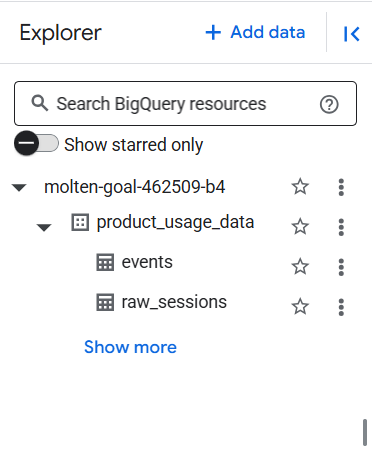

# Phase 1: Data Acquisition & Setup Documentation

**Objective:** To identify a suitable dataset, acquire it, and set up the necessary cloud infrastructure (Google BigQuery) to prepare the data for product analytics simulation. The goal was to transform raw session data into a granular event stream that mimics data from tools like Pendo or Amplitude.

---

### I. Kaggle Dataset Link

* **Dataset Name:** Speakers Sales Conversion Dataset
* **URL:** [https://www.kaggle.com/datasets/sandeep1080/bassburst](https://www.kaggle.com/datasets/sandeep1080/bassburst)

---

### II. Brief Explanation: Why this Dataset? How it Maps to Product Analytics Data Model

The **"Speakers Sales Conversion Dataset"** dataset was chosen for its suitability in simulating a product analytics data model, despite not being a direct event stream. Its structure allowed for the realistic synthesis of user behavior within a simulated product environment.

**Mapping to a "Pendo/Amplitude" Data Model:**

The core challenge was transforming the session-level data into a granular event stream (`events` table) where each row represents a distinct user action with a precise timestamp.

* **`user_id`**:
    * **Source:** Directly available as the `user_id` column in the raw dataset.
    * **Mapping:** Serves as the unique identifier for individual users.

* **`session_id`**:
    * **Source:** Directly available as the `session_id` column in the raw dataset.
    * **Mapping:** Identifies distinct user sessions. Essential for grouping events into user journeys.

* **`event_name`**:
    * **Source:** Synthesized from the `raw_sessions` data based on key actions and transitions.
    * **Mapping:** Created specific event types for analysis:
        * `session_start`: Marks the beginning of a user session.
        * `session_end`: Marks the end of a user session.
        * `purchase_completed`: When `conversion_flag = 1` and `conversion_type = 'Purchased'`.
        * `signup_completed`: When `conversion_flag = 1` and `conversion_type = 'Signed Up'`.
        * `coupon_applied`: When `coupon_applied` is not 'ND'.
        * `signed_in_event`: When `sign_in` is 'Email'.
        * `bounced_session_event`: When `bounce_flag = 1`.

* **`event_timestamp`**:
    * **Source:** Synthesized due to the absence of direct, real-world timestamps in the original dataset's `timestamp` column (which contained `MM:SS.ms` duration strings). The `time_spent` column (float, representing session duration) was used as the basis.
    * **Mapping:** Generated by taking an arbitrary base date (`2025-01-01 00:00:00 UTC`), adding a unique, consistent offset per session (`FARM_FINGERPRINT` of `session_id` modulo 1 year's seconds), and then adding fractional parts of the `session_duration_seconds` for individual events within a session. This creates a realistic-looking spread of events over time.

* **`event_properties`**:
    * **Source:** Various columns from the raw dataset.
    * **Mapping:** Contextual information tied to specific events. Examples include:
        * `event_property_device_type`
        * `event_property_traffic_source`
        * `event_property_pages_visited` (for `session_end` and `conversion` events)
        * `event_property_revenue` (for `purchase_completed` events)
        * `event_property_product_purchased` (for `purchase_completed` events)
        * `event_property_coupon_applied_flag` (for `coupon_applied` and `conversion` events)

* **`user_properties`**:
    * **Source:** User-specific demographic and behavioral columns from the raw dataset.
    * **Mapping:** Attributes associated with the user, persisting across sessions/events. Examples include:
        * `name`
        * `demographic_age`
        * `demographic_age_group`
        * `demographic_gender`
        * `email`
        * `location`
        * `country`
        * `is_signed_in_session` (derived from `sign_in`)
        * `is_bounced_session` (derived from `bounce_flag`)

---

### III. BigQuery Table Name

* **Raw Data Table:** `molten-goal-462509-b4.product_usage_data.raw_sessions`
* **Transformed Events Table:** `molten-goal-462509-b4.product_usage_data.events`

---

### IV. Visual Evidence

* **Raw Sessions Table Schema:**
    
    *A screenshot of the schema for your `raw_sessions` table in the BigQuery console.*

* **Events Table Schema:**
    
    
    *A screenshot of the schema for your newly created `events` table in the BigQuery console.*

* **BigQuery Dataset Creation:**   
    *The BigQuery Explorer showing the `product_usage_data` dataset.*