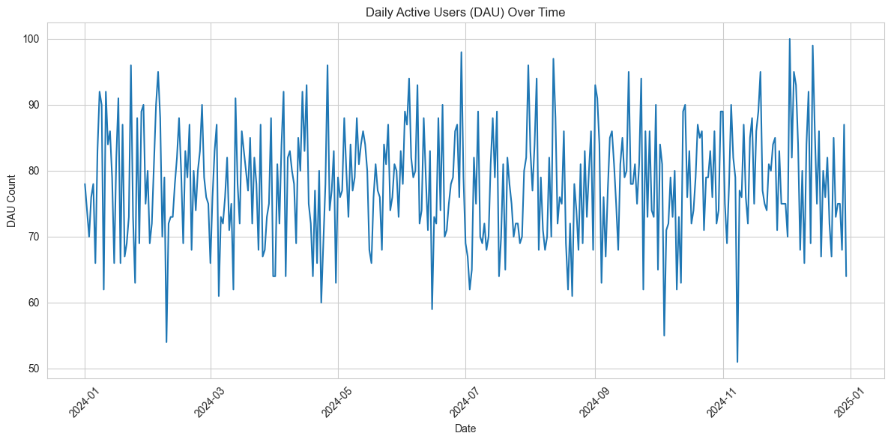
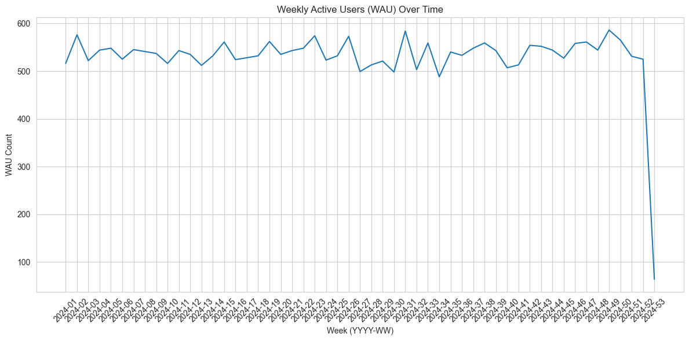
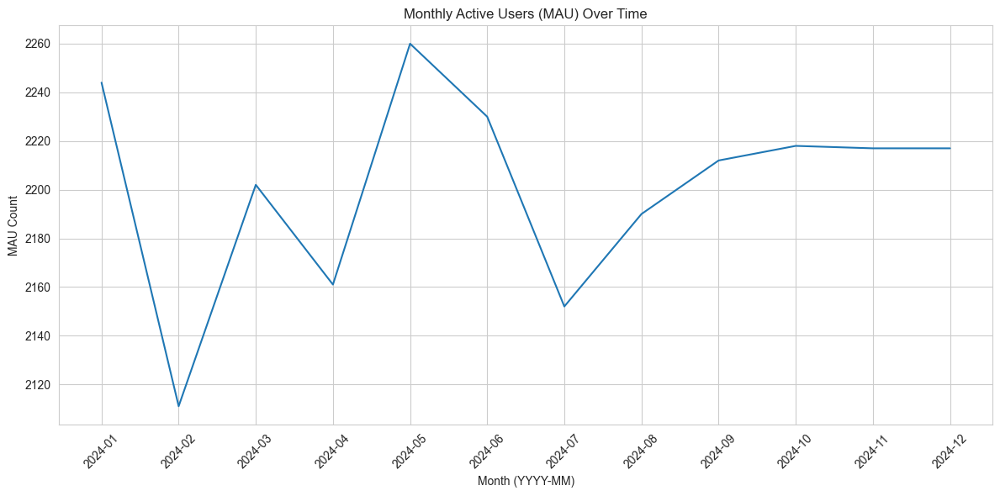

# Phase 2: Exploratory Data Analysis (EDA) & Core Metrics Calculation Documentation

**Objective:** To conduct a comprehensive Exploratory Data Analysis (EDA) on the `raw_sessions` and `events` datasets to understand their structure, quality, and key characteristics. Following the EDA, this phase focuses on calculating and analyzing core product analytics metrics (DAU, WAU, MAU, Conversion Rates, Funnel Performance) to derive initial insights into user behavior and product health.

---

### I. Exploratory Data Analysis (EDA) Overview

The EDA was performed using Python (Pandas, Matplotlib, Seaborn) in the `notebooks/exploratory_data_analysis.ipynb`. It involved:
* Loading `cleaned_speakers_data.csv` and performing the feature engineering steps directly in Python to create the `df_events` DataFrame, ensuring self-contained reproducibility.
* Basic data overview (`.head()`, `.info()`, `.describe()`, `isnull().sum()`, `nunique()`).
* Univariate analysis (histograms, box plots for numerical data; count plots for categorical data).
* Bivariate analysis (scatter plots for numerical-numerical; box plots for categorical-numerical; count plots for categorical-categorical; correlation matrices).
* Basic time-series analysis (DAU, WAU, MAU trends).

**Key Insights from EDA:**

* **Data Size & Completeness:** The `df_raw_sessions` DataFrame contains 30,000 rows. The engineered `df_events` (representing granular user actions) expands to 92,048 rows, confirming a successful transformation. Both datasets exhibited excellent data quality with zero missing values, simplifying subsequent analysis.
* **User Demographics:** The user base shows a healthy distribution across age groups ('Adult', 'Old', 'Teenage') and is fairly balanced by gender, with a small 'No Answer' segment.
* **Engagement Metrics:** Raw sessions averaged ~10.5 minutes (`time_spent`) and ~5.5 pages visited (`pages_visited`), indicating a generally engaged user base.
* **Conversion Patterns:** Approximately 15% of sessions in `df_raw_sessions` result in conversion (`1`), with 'Purchase' being more frequent than 'Signup'. A significant portion (19%) of sessions are bounces.
* **Coupon Impact:** Initial observations suggest a strong correlation between `coupon_applied` ('Yes') and `conversion_flag` in `df_raw_sessions`, indicating coupons are an important conversion driver. However, a notable number of purchases also occurred without coupon application.
* **Traffic & Device:** 'Organic' traffic is dominant. Mobile is the most common device type, highlighting its importance in the user base.
* **Time-Series Stability:** DAU, WAU, and MAU trends show a stable pattern over the simulated period, with no dramatic growth/decline or pronounced seasonality, which is characteristic of the synthetic nature of the dataset.

---

### II. Core Product Metrics Calculation & Visualization

Based on the `events` table, core product metrics were calculated and visualized to provide a holistic view of product performance. These calculations inform overall product health and highlight areas for deeper investigation.

1.  **Active Users (DAU, WAU, MAU):**
    * **Description:** Daily, Weekly, and Monthly Active Users (DAU, WAU, MAU) were calculated by counting distinct `user_id`s within daily, weekly, and monthly timeframes from the `events` table (specifically filtering for activity events like `session_start`, `signed_in_event`, `purchase_completed`, `signup_completed`, `coupon_applied`).
    * **Insights:** The active user trends remained relatively stable over the simulated period, validating the dataset's consistency for analytical purposes.
    * **Visualization:** Line plots showcasing the trends of DAU, WAU, and MAU over time. 
    
    
    

2.  **Session Engagement Metrics:**
    * **Description:** Metrics like average session duration (`event_property_time_spent_seconds`) and average pages visited (`event_property_pages_visited`) were derived from the `events` table.
    * **Insights:** Confirmed that active users spend a meaningful amount of time and visit several pages within a session, indicating sustained engagement.

3.  **Conversion Rates (Overall & By Device Type):**
    * **Description:** Overall purchase and signup conversion rates were calculated, along with breakdowns by `event_property_device_type`.
    * **Insights:** Mobile devices demonstrated the highest conversion rates for both purchases and signups, suggesting a strong mobile user experience or a mobile-centric user base.
    * **Visualization:** Bar charts comparing conversion rates across different device types.
        

4.  **Funnel Analysis:**
    * **Description:** A key user funnel was defined as: `Session Start` $\rightarrow$ `Signed In` $\rightarrow$ `Coupon Applied` $\rightarrow$ `Purchase Completed`. User counts and drop-off percentages were tracked at each step.
    * **Insights:** The analysis revealed a significant **74% drop-off** between the "Signed In" and "Coupon Applied" steps. This bottleneck represents a critical area for optimization. It was also noted that a substantial number of purchases occurred even without coupon application, indicating the presence of non-coupon driven conversions.
    * **Visualization:** A funnel chart illustrating user progression and drop-offs.
        

---

### III. Initial Hypotheses & Next Steps

* The significant drop-off identified in the funnel analysis, particularly around coupon application, is a prime candidate for deeper investigation.
* The strong correlation between coupon application and purchase completion suggests that optimizing this part of the user journey could yield substantial improvements.
* The insights derived from this combined EDA and Core Metrics phase set the foundation for **Phase 3: Deep Dive Analysis & Recommendations** and **Phase 4: Predictive Modeling for Conversion**.